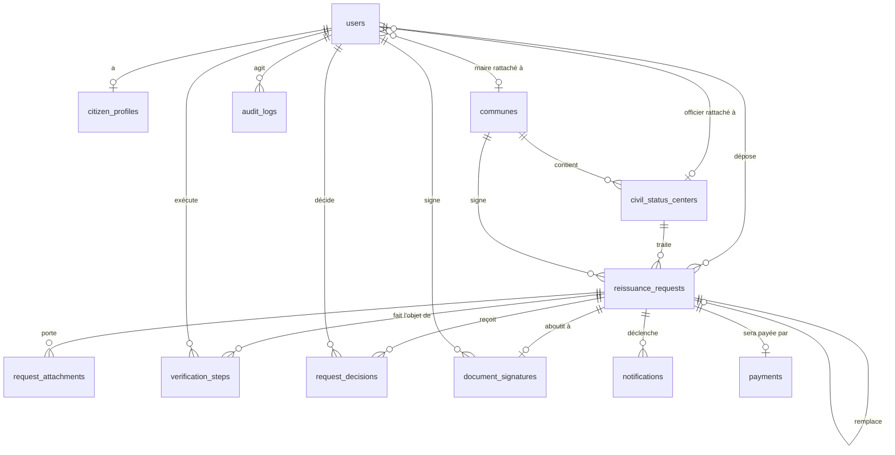

# Modèle de données

- **Date :** 2026-09-06
- **SGBD :** PostgreSQL, en local (D-011). Aucune dépendance à Supabase dans le
  code : seule la chaîne de connexion changerait.
- **Source de vérité du schéma :** `database/migrations/`, gérées par Laravel.
  Aucune modification de schéma par un autre moyen.

---

## 1. Diagramme



---

## 2. Tables

### 2.1 Référentiel géographique

L'audit a relevé trois listes de centres incohérentes dans le prototype
(§4.1). Une seule source, avec clés étrangères.

**`communes`** — `id`, `code` (unique), `name`, `region`, `is_active`,
horodatages.

**`civil_status_centers`** — `id`, `code` (unique), `name`, `city`,
`commune_id` → `communes`, `is_active`, horodatages.

> Le rattachement centre → commune est ce qui permet à une demande de savoir
> quel maire est compétent. Il est **obligatoire**.

### 2.2 Comptes

**`users`**

| Colonne | Type | Note |
|---|---|---|
| `id` | bigint | |
| `email` | citext unique | |
| `password` | text | Argon2id |
| `role` | text | `citizen` \| `officer` \| `mayor` \| `admin`, contrainte CHECK |
| `status` | text | `active` \| `suspended` \| `disabled`, contrainte CHECK |
| `civil_status_center_id` | bigint null | **obligatoire si `role='officer'`** |
| `commune_id` | bigint null | **obligatoire si `role='mayor'`** |
| `two_factor_secret` | text null | chiffré |
| `two_factor_confirmed_at` | timestamptz null | |
| `last_login_at`, `last_login_ip` | | |

Le rattachement est appliqué en base, pas seulement dans le code :

```sql
ALTER TABLE users ADD CONSTRAINT users_role_scope_check CHECK (
  (role = 'officer' AND civil_status_center_id IS NOT NULL AND commune_id IS NULL)
  OR (role = 'mayor' AND commune_id IS NOT NULL AND civil_status_center_id IS NULL)
  OR (role IN ('citizen','admin') AND civil_status_center_id IS NULL AND commune_id IS NULL)
);
```

Un officier sans centre est donc **impossible à créer**, y compris par un bug.
C'est la contrepartie en base du principe n°2 de `docs/PERMISSIONS.md`.

Contrainte 2FA (§4.1) :

```sql
ALTER TABLE users ADD CONSTRAINT users_official_2fa_check CHECK (
  role = 'citizen' OR status <> 'active' OR two_factor_confirmed_at IS NOT NULL
);
```

Un compte officiel ne peut pas être `active` sans 2FA confirmée.

**`citizen_profiles`** — `user_id` (unique), `first_name`, `last_name`,
`birth_date`, `birth_place`, `national_id_number` **(chiffré)**,
`national_id_hash` (voir §3), `phone`, `address`, `completed_at`.

### 2.3 Demandes

**`reissuance_requests`**

| Colonne | Note |
|---|---|
| `id`, `reference` | référence unique publique, `PHX-` + suffixe non séquentiel (§3.4) |
| `user_id` | demandeur |
| `civil_status_center_id`, `commune_id` | **figés à l'envoi**, jamais recalculés |
| `status` | contrainte CHECK + déclencheur, voir `STATE_MACHINE.md` |
| `assigned_officer_id` | null tant que `pending` |
| `document_type` | `birth_certificate` pour l'instant |
| `reason` | `lost` \| `damaged` — **champ absent du prototype**, exigé par le brief |
| `copies_requested` | entier ≥ 1 — absent du prototype |
| `full_name_at_birth`, `date_of_birth`, `place_of_birth`, `registration_year`, `original_certificate_number` | repris de `form.html` |
| `father_name`, `father_nationality`, `mother_name`, `mother_nationality`, `parents_address` | repris de `form.html` |
| `consent_given_at` | consentement au traitement — absent du prototype |
| `supersedes_id` | → `reissuance_requests`, chaînage des reprises après état terminal |
| `submitted_at`, horodatages | |

Les champs « acte de naissance » et « parents » viennent du prototype et vont
au-delà du §6 du brief. Ils sont conservés : ce sont eux qui permettent la
recherche de l'acte d'origine à l'étape 4 de l'officier.

**Index** — sur les colonnes de filtrage des tableaux de bord (§6) :

```
(civil_status_center_id, status, submitted_at DESC)   -- file officier
(commune_id, status, submitted_at DESC)               -- file maire
(user_id, created_at DESC)                            -- suivi citoyen
(assigned_officer_id, status)                         -- charge par agent
(reference) UNIQUE
```

**`request_attachments`** — `id`, `request_id`, `kind`
(`selfie` \| `id_document`), `disk`, `path` (identifiant opaque, jamais dérivé
du nom ou du numéro de pièce), `mime_type`, `size_bytes`, `checksum_sha256`,
`captured_at`, `purge_after`.

> **Aucune image en base.** Seules les références et métadonnées (§6). Le
> binaire vit sur disque, hors de `public/`, servi uniquement par un contrôleur
> qui vérifie la Policy et journalise (D-011).

### 2.4 Traçabilité du travail — entités absentes du brief, déduites des parcours

**`verification_steps`** — les 5 étapes du §5.3, persistées **séparément** pour
qu'une vérification interrompue soit reprenable.

`id`, `request_id`, `cycle` (entier, incrémenté à chaque retour du maire —
voir `STATE_MACHINE.md` §3.3), `step` (1..5), `officer_id`, `result`
(`match` \| `no_match` \| `inconclusive` \| `provider_unavailable`),
`payload` (jsonb — réponse brute de l'adaptateur, sans donnée superflue),
`started_at`, `completed_at`.

Unicité sur `(request_id, cycle, step)`. Les lignes ne sont **jamais écrasées** :
une reprise crée un nouveau cycle.

Le résultat `provider_unavailable` est explicite : le §9 exige que
l'indisponibilité d'une base externe ne bloque pas l'officier sans explication.

**`request_decisions`** — `id`, `request_id`, `actor_id`, `actor_role`,
`decision` (`accepted` \| `rejected` \| `escalated` \| `signed` \|
`approved_by_exception` \| `returned`), `reason` (**obligatoire** pour tout ce
qui n'est pas `accepted`/`signed`), `internal_notes`, `from_status`,
`to_status`, `created_at`. Ajout seul.

**`document_signatures`** — `id`, `request_id` (unique), `mayor_id`,
`document_hash` (SHA-256 du PDF produit), `signature_payload` (jsonb, preuve
renvoyée par le prestataire), `provider`, `signed_at`.

`document_hash` est ce qui permet de prouver plus tard qu'un acte présenté est
bien celui qui a été signé.

**`notifications`** — `id`, `user_id`, `request_id`, `channel`, `type`,
`payload`, `sent_at`, `failed_at`, `attempts`, `last_error`.

Persistées avant envoi. Un échec n'annule jamais une transition d'état
(contrainte maintenue de D-006), et la file rejoue.

**`payments`** — hors périmètre jusqu'au jalon 7. La table est prévue au
diagramme, **non créée** : aucun montant n'est codé (D-003).

### 2.5 `audit_logs` — en ajout seul

`id`, `actor_id` (nullable — un échec de connexion n'a pas d'acteur connu),
`actor_role`, `action`, `auditable_type`, `auditable_id`, `from_status`,
`to_status`, `reason`, `ip_address`, `session_fingerprint`, `created_at`.

L'ajout seul est appliqué par **révocation de droits**, pas par convention
(§4.4) :

```sql
CREATE ROLE phoenix_app LOGIN PASSWORD :'app_password';
GRANT SELECT, INSERT, UPDATE, DELETE ON ALL TABLES IN SCHEMA public TO phoenix_app;
REVOKE UPDATE, DELETE ON audit_logs FROM phoenix_app;
```

Le rôle applicatif **n'est pas** le propriétaire du schéma. Les migrations
tournent sous un rôle distinct, jamais utilisé par l'application.

> **Conséquence à assumer :** `php artisan migrate:fresh` et tout effacement de
> table d'audit sont impossibles avec le rôle applicatif. C'est voulu. La
> procédure de réinitialisation en développement est documentée dans
> `docs/ARCHITECTURE_LOCAL.md`.

Index : `(actor_id, created_at DESC)`, `(auditable_type, auditable_id, created_at DESC)`.

---

## 3. Chiffrement du numéro de pièce, et ce qu'il coûte

Le §6 exige le chiffrement applicatif des champs les plus sensibles. Le numéro
de pièce est chiffré par un *cast* Laravel `encrypted`.

**Conséquence directe : un champ chiffré n'est pas interrogeable.** Ni `WHERE`,
ni `LIKE`, ni index. Or l'officier doit rechercher par numéro de pièce
(§5.3, étape 4).

**Solution retenue — index aveugle.** À côté de `national_id_number` chiffré,
une colonne `national_id_hash` contenant :

```
HMAC-SHA256(numéro normalisé, clé dédiée distincte de APP_KEY)
```

- La normalisation (majuscules, suppression des espaces et tirets) est
  centralisée dans une seule fonction, testée.
- Index unique sur `national_id_hash` : détecte aussi les doublons de demande.

**Ce que cela permet et ne permet pas :**

| Besoin | Possible ? |
|---|---|
| Rechercher par numéro exact | ✅ |
| Détecter deux comptes avec le même numéro | ✅ |
| Recherche partielle ou approchante | ❌ |
| Tri par numéro | ❌ |
| Lecture du numéro par un accès direct à la base | ❌ |

L'interface de recherche de l'officier n'offrira donc **pas** de recherche
partielle sur le numéro de pièce. C'est un choix de sécurité assumé, pas un
oubli, et il doit être visible dans l'écran plutôt que subi.

⚠ **Point à trancher :** la clé HMAC. Une clé distincte de `APP_KEY` est plus
propre, mais ajoute un secret à gérer et à ne jamais perdre — sa perte rend
toute recherche par numéro impossible, sans perte de données. Je recommande la
clé distincte, avec la procédure de sauvegarde documentée avant le jalon 3.

---

## 4. Ce que le prototype collectait et que je ne reprends pas

| Champ | Décision |
|---|---|
| `userGender` (`signin.html`) | **Non repris.** Collecte sans finalité identifiée (audit §12.3). S'il s'avère nécessaire à l'acte, il appartient à `reissuance_requests`, pas au compte. |
| `userPassword` en `localStorage` | Évidemment non repris (audit §6.1). |
| Montant de 20 000 CFA | Non repris (D-003). |
| Nationalité des parents en saisie libre | Repris, mais en **liste fermée** — la saisie libre rend la donnée inexploitable. |

---

## 5. Jeux de démonstration

Conformément à D-004 et au garde-fou n°1 : **aucune donnée réelle**. Les
*seeders* produisent des identités explicitement fictives — références
`DEMO-…`, adresses `@example.test`, numéros de pièce hors de tout format réel.

Contenu : les communes et centres du périmètre retenu, un compte par rôle, et
un échantillon de demandes couvrant **chacun des 7 états**, y compris les cas
d'échec (non-correspondance police, service indisponible), afin que les écrans
soient testables dans leurs états dégradés et pas seulement dans le cas heureux.
