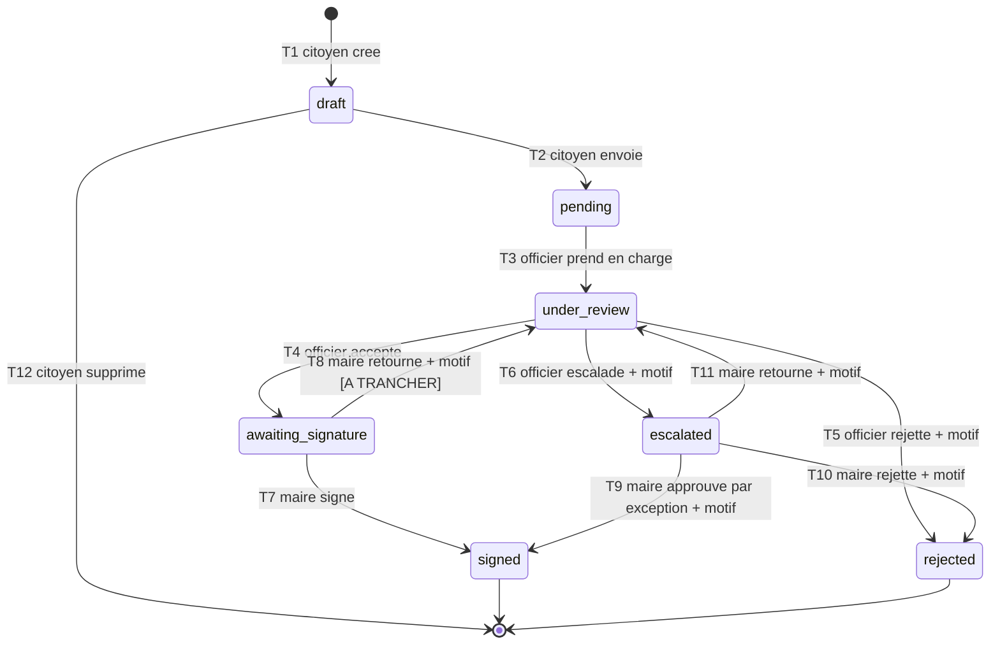

# Cycle de vie d'une demande — machine à états

> **Ce document doit être validé avant toute implémentation** (§7 du brief).
> Les points marqués **⚠ À TRANCHER** sont des ambiguïtés du brief que je ne
> lève pas seul.

- **Date :** 2026-09-06
- **Portée :** demande de réédition d'acte de naissance

---

## 1. États

| État | Signification | Libellé affiché (français) | Terminal |
|---|---|---|---|
| `draft` | Le citoyen remplit sa demande, étape par étape | « Brouillon — non envoyé » | non |
| `pending` | Demande envoyée, en attente de prise en charge | « Envoyée — en attente de traitement » | non |
| `under_review` | Un officier a pris la demande en charge | « En cours de vérification » | non |
| `awaiting_signature` | Vérification acceptée, en attente du maire | « En attente de signature du maire » | non |
| `escalated` | Remontée au maire pour arbitrage | « Transmise au maire pour arbitrage » | non |
| `signed` | Acte signé et disponible | « Signée — acte disponible » | **oui** |
| `rejected` | Demande refusée | « Refusée » | **oui** |

**L'interface n'affiche jamais la valeur technique**, seulement le libellé
(§8.1 du brief). Le prototype affichait `escalated` brut : ce défaut n'est pas
porté.

### Ajout par rapport au brief : `draft`

Le brief liste six états et ne mentionne pas `draft`. Il devient nécessaire du
fait de **D-010** : sans Livewire, le formulaire multi-étapes persiste chaque
étape validée côté serveur. Une demande existe donc en base **avant** d'être
envoyée.

Conséquences, volontaires :

- Une demande `draft` n'est **jamais** visible par un officier, un maire ou un
  administrateur. Elle n'existe que pour son auteur.
- Le citoyen peut supprimer son propre brouillon. C'est la **seule** suppression
  autorisée dans tout le système, et elle ne concerne que des données non
  encore soumises.
- Un brouillon ne compte dans aucun tableau de bord ni aucune statistique.

---

## 2. Table des transitions autorisées

**Toute transition absente de cette table est interdite.** C'est la référence
unique : l'implémentation la reproduit, elle ne l'interprète pas.

| # | État source | Rôle | Action | État cible | Motif | Conditions supplémentaires |
|---|---|---|---|---|---|---|
| T1 | *(néant)* | citoyen | créer | `draft` | — | profil citoyen complet |
| T2 | `draft` | citoyen (auteur) | envoyer | `pending` | — | **toutes** les pièces présentes et tous les champs requis validés côté serveur |
| T3 | `pending` | officier | prendre en charge | `under_review` | — | l'officier est rattaché au **centre** de la demande ; la demande n'est prise par personne d'autre |
| T4 | `under_review` | officier (celui qui a pris en charge) | accepter | `awaiting_signature` | facultatif | **les 5 étapes de vérification ont un résultat enregistré** |
| T5 | `under_review` | officier (celui qui a pris en charge) | rejeter | `rejected` | **obligatoire** | les 5 étapes ont un résultat enregistré |
| T6 | `under_review` | officier (celui qui a pris en charge) | escalader | `escalated` | **obligatoire** | — |
| T7 | `awaiting_signature` | maire | signer | `signed` | — | le maire est rattaché à la **commune** de la demande ; une signature est produite et son empreinte enregistrée |
| T8 | `awaiting_signature` | maire | retourner à l'officier | `under_review` | **obligatoire** | ⚠ **À TRANCHER** — voir §3.1 |
| T9 | `escalated` | maire | approuver par exception | `signed` | **obligatoire** | le maire est rattaché à la commune ; signature produite |
| T10 | `escalated` | maire | rejeter | `rejected` | **obligatoire** | le maire est rattaché à la commune |
| T11 | `escalated` | maire | retourner à l'officier | `under_review` | **obligatoire** | le maire est rattaché à la commune |
| T12 | `draft` | citoyen (auteur) | supprimer | *(effacé)* | — | seule suppression autorisée du système |

### Ce qu'aucune ligne n'autorise, et c'est voulu

- **Aucun chemin ne mène à `signed` sans un maire habilité de la commune.**
  Seules T7 et T9 produisent `signed`.
- **Aucun chemin ne mène à `awaiting_signature` sans un officier habilité du
  centre ayant renseigné les 5 étapes.** Seule T4 y mène.
- **`pending` ne peut pas devenir `awaiting_signature` directement.** Le passage
  par `under_review` est obligatoire.
- **`signed` et `rejected` n'ont aucune transition sortante.** Toute reprise
  passe par une nouvelle demande liée à la précédente
  (`reissuance_requests.supersedes_id`).
- **L'administrateur n'apparaît dans aucune ligne.** Il ne peut faire avancer
  aucune demande. C'est l'application du §4.2 : gouvernance et données séparées.

---

## 3. Points à trancher

### 3.1 ⚠ Que peut faire le maire sur une demande « prête à signer » ?

Ton schéma du §7 fait partir une flèche de `awaiting_signature` vers
`escalated`. Je ne l'ai pas reprise telle quelle : un maire qui « escalade »
une demande se la transmettrait à lui-même, puisqu'il est déjà l'autorité
d'arbitrage.

Ton §5.4 dit par ailleurs que les trois actions *Retourner / Approuver par
exception / Rejeter* s'appliquent aux demandes **escaladées**, et que les
demandes validées donnent lieu à « revue du dossier et des pièces →
signature ». Le cas « le maire ouvre un dossier prêt à signer et le trouve
insuffisant » n'est pas couvert.

J'ai proposé **T8 : retour à l'officier avec motif obligatoire**, ce qui me
paraît le comportement attendu. Trois options :

| Option | Effet |
|---|---|
| **A — T8 telle que proposée** *(recommandée)* | Le maire renvoie à l'officier avec motif. Le dossier repart en `under_review`. |
| B — Aucune sortie hors signature | Le maire ne peut que signer. Un dossier insuffisant reste bloqué : impasse. |
| C — `awaiting_signature` → `rejected` | Le maire rejette directement. Court-circuite l'officier, et rend le rejet moins traçable. |

### 3.2 ⚠ Une demande retournée repart-elle chez le même officier ?

T8 et T11 ramènent en `under_review`. Deux lectures :

- **Le même officier** reprend le dossier — cohérent avec la responsabilité
  nominative, mais bloque si l'agent est absent.
- **N'importe quel officier du centre** peut la reprendre — plus robuste, mais
  dilue la responsabilité.

Je recommande : **le même officier par défaut, réattribuable par un
administrateur**. Cela suppose une action de réattribution qui n'est pas une
transition d'état — voir `docs/PERMISSIONS.md`.

### 3.3 ⚠ Que deviennent les vérifications après un retour ?

Quand une demande revient en `under_review`, les 5 étapes déjà renseignées
sont-elles conservées ou remises à zéro ?

Je recommande : **conservées et horodatées, jamais écrasées**. Une nouvelle
passe de vérification crée de **nouvelles** lignes dans `verification_steps`
avec un numéro de cycle incrémenté. On garde ainsi la trace de ce qui avait été
vu la première fois — ce qui est précisément ce qu'un audit anti-fraude a
besoin de reconstituer.

---

## 4. Application au niveau des données

Le §7 du brief exige qu'une transition interdite **échoue au niveau des
données**, pas seulement dans les contrôleurs. Trois couches, la troisième
étant celle qui compte.

### Couche 1 — application

Une énumération PHP `RequestStatus` et un service `RequestTransitionService`
seul habilité à écrire `status`. Aucun contrôleur, aucune vue, aucun *seeder*
n'écrit `status` directement.

### Couche 2 — contrainte de domaine

```sql
ALTER TABLE reissuance_requests
  ADD CONSTRAINT reissuance_requests_status_check
  CHECK (status IN ('draft','pending','under_review',
                    'awaiting_signature','escalated','signed','rejected'));
```

Empêche une valeur inventée. N'empêche pas une transition illégale.

### Couche 3 — déclencheur PostgreSQL *(celle qui applique réellement la règle)*

Une table `allowed_transitions (from_status, to_status)` alimentée par migration
depuis la table du §2, et un déclencheur `BEFORE UPDATE` sur
`reissuance_requests` qui :

1. laisse passer si `status` n'est pas modifié ;
2. **rejette toute sortie de `signed` ou `rejected`** — états terminaux ;
3. rejette tout couple `(OLD.status, NEW.status)` absent de
   `allowed_transitions` ;
4. rejette si aucune ligne d'audit correspondante n'est écrite dans la même
   transaction.

Le point 4 est ce qui rend le §4.4 opposable : **une transition sans trace
d'audit est impossible**, même par un bug applicatif, même par une requête SQL
manuelle.

> **Réserve honnête :** le point 4 impose que l'écriture de l'audit précède
> celle du statut dans la même transaction. C'est réalisable, mais c'est le
> point le plus délicat du dispositif et je le vérifierai par un test dédié au
> jalon 1 avant de m'en prévaloir.

---

## 5. Écriture au journal d'audit

**Chaque transition écrit une ligne d'audit**, sans exception (§4.4) :

acteur, rôle, action, entité visée, **statut source**, **statut cible**, motif,
horodatage, adresse IP, empreinte de session.

`audit_logs` est en ajout seul : ni `UPDATE`, ni `DELETE`, y compris pour un
administrateur. Appliqué par révocation des droits sur le rôle applicatif
PostgreSQL, pas par convention — détaillé dans `docs/DATA_MODEL.md`.

---

## 6. Diagramme



---

## 7. Couverture de tests exigée

Le §7 demande des tests exhaustifs. Concrètement, pour 7 états × 4 rôles
× l'ensemble des actions :

1. **Les 12 transitions autorisées passent**, chacune avec le bon rôle et le
   bon rattachement.
2. **Toutes les autres sont refusées.** Le test est généré par produit
   cartésien : tout couple `(source, cible)` hors table doit lever une
   exception. C'est le test qui compte — un test qui ne prouve que le cas
   heureux ne prouve rien (§4.2).
3. **Refus par rattachement** : un officier du centre A ne peut pas prendre en
   charge une demande du centre B, même avec le bon rôle et le bon état. Idem
   pour un maire hors de sa commune.
4. **Refus par étapes manquantes** : T4 échoue tant que les 5 étapes n'ont pas
   de résultat.
5. **Refus de motif manquant** : T5, T6, T8, T9, T10, T11 échouent sans motif.
6. **Terminalité** : aucune sortie de `signed` ni de `rejected`, testée
   depuis le service **et** en SQL direct pour vérifier le déclencheur.
7. **Audit** : chaque transition réussie produit exactement une ligne
   d'audit, avec les bons statuts source et cible.
